<div align="center">



<br>

**`CallMeHFK`** · UTC+8

**系统思考者 —— 站在技术与业务的交界处**

> 用数据与事实做决策，不用感觉。先盘点再行动，确认了快速推进。
> 质量是底线，效率是目标。

</div>

---

<div class="section-head"><h2>图解</h2><span class="tag">ASCII</span></div>

### 多智能体共识排序

<div class="diagram">
候选答案 ──→ <span class="a">Judge</span> A ──┐
                <span class="a">Judge</span> B ──┼──→ Borda 聚合 ──→ 最终排序
                Judge C ──┘      多模型独立打分，
                                 交叉一致性报告

</div>

### Agent Skill 生态闭环

<div class="diagram">
<span class="a">安装</span> ──→ <span class="a">运行</span> ──→ <span class="a">蒸馏</span> ──→ <span class="a">评分</span>（SkillLens 9 维）
  ↑                                      │
  └──────────── 优化（SkillOpt 门控） ────┘

</div>

### 决策边界

<div class="diagram">
<span class="b">参数调优</span> ──→ 碰到<span class="b">物理上限</span> ──→ <span class="c">立即转向</span>
     │                              │
     └── <span class="a">建立基线</span> → <span class="a">改进</span> → <span class="a">对比基线</span> ←┘

</div>

---

<div class="section-head"><h2>项目与成果</h2><span class="tag">自建 · 适配</span></div>

### 自建

| 项目 | 做了什么 | 事实 |
|---|---|---|
| [qwenpaw-consensus-rank](https://github.com/CallMeHFK/qwenpaw-consensus-rank) | 多评审 LLM 共识排序插件 | 多模型独立打分 → Borda 聚合，输出交叉一致性报告；QwenPaw 原生插件 |
| [skill-recorder](https://github.com/CallMeHFK/skill-recorder) | 桌面端工作流录制工具 | 录制 → 意图 + 有序步骤 → 可复用 Skill 或自动化 |
| ATPO | 自适应树策略优化 | 多轮对话场景下的策略搜索与冷启动 |

### 适配与贡献

| 项目 | 做了什么 | 事实 |
|---|---|---|
| [sepia](https://github.com/Nanako0129/sepia) | QwenPaw 插件适配 | 将 Agent Skill 兼容的去 AI 味写作技能包适配为 QwenPaw 原生插件（issue #244 → PR）；基于 StoryScope（arXiv:2604.03136）叙事结构检测 |
| [text-to-cad](https://github.com/CallMeHFK/text-to-cad) | CAD/CAE/CAM Skill 库接入 | 将 STEP / STL / 3MF / URDF / SDF / SRDF 六种产物格式的 Agent Skill 库接入本地生态 |
| Agent Skill 工程化 | 技能蒸馏与质量门控 | 182 个已安装 Skill；SkillLens 9 维评分 + SkillOpt 门控优化闭环 |

---

<div class="section-head"><h2>能力画像</h2><span class="tag">能力 × 证据</span></div>

- **多智能体系统** — AgentScope / QwenPaw 多端派发，MCP 协议接入，技能路由与共识
- **Agent Skill 工程** — 技能安装、蒸馏、评分（SkillLens 9 维）、门控优化全链路
- **插件开发** — QwenPaw 原生插件开发与适配（共识排序、sepia 去 AI 味）
- **算法与数据** — 自适应树策略优化（ATPO），数据驱动的参数与方案选型
- **嵌入式与固件** — 周期精确仿真验证，性能结论落到指令级证据
- **工业软件** — TPM 数字员工平台部署，TDMS 缺陷提取流水线

---

<div class="section-head"><h2>技术栈</h2><span class="tag">Badges</span></div>

[](https://www.python.org/)
[](https://www.typescriptlang.org/)
[](https://en.wikipedia.org/wiki/C_(programming_language))
[](https://en.wikipedia.org/wiki/IEC_61131)
[](https://www.kicad.org/)
[](https://www.kernel.org/)
[](https://git-scm.com/)
[](https://github.com/agentscope-ai/QwenPaw)
[](https://modelcontextprotocol.io/)
[](https://renode.readthedocs.io/)

---

<div class="section-head"><h2>运行原则</h2><span class="tag">principles.txt</span></div>

<div class="principles"><pre><code>$ cat principles.txt
[0] 先盘点，再行动      建立基线 → 改进 → 对比基线，不盲目启动
[1] 数据驱动不迷信      源码 > 配置 > 运行态；禁止口算，工具算完再输出
[2] 逐字保真            源数据神圣不可改；可加标注，禁止「优化」改写
[3] 物理极限即边界      参数调优空间可迭代，碰物理上限立即转向，不死磕
[4] 诚实纠错            新数据推翻旧结论 → 明确记录「上一轮我说 X 是错误的」
[5] 工具链即基础设施    按任务安装不膨胀；必须有退路，否则不上
</code></pre></div>
```

<div class="section-head"><h2>当前</h2><span class="tag">in-progress</span></div>

- **多智能体工具链** — QwenPaw 多端派发、技能蒸馏、共识排序
- **开源** — sepia 去 AI 味写作技能包（QwenPaw 插件适配推进中）· qwenpaw-consensus-rank 多评审共识排序
- **嵌入式与固件** — 周期精确仿真验证，性能结论落到指令级证据

---

<div align="center">

<div class="footnote">*「写得进去的部分，已经足够强大。」—— 但做不出来，比说不清楚更致命。*</div>

</div><div class="section-head"><h2>项目与成果</h2><span class="tag">自建 · 适配</span></div>

### 自建

<table class="project-table self">
<thead>| 项目 | 做了什么 | 事实 |
|---|---|---|</thead>
<tbody>
</tbody></table>

### 适配与贡献

<table class="project-table adapt">
<thead>| 项目 | 做了什么 | 事实 |
|---|---|---|</thead>
<tbody>
</tbody></table>

---

<div class="section-head"><h2>能力画像</h2><span class="tag">能力 × 证据</span></div>

<div class="cap-grid">
</div>

---


