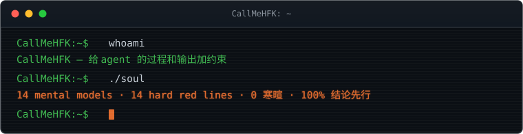

<div align="center">



<br>

**`CallMeHFK`** · UTC+8 · Agent 系统工程师

过程监督 / 输出路由 / 技能质量


<code></code>
<code></code>
<code></code>
<code></code>
<code></code>
<code></code>
<code></code>
<code></code>


</div>

## 仓库速览

| 仓库 | 是什么 | 测试 | 版本 |
|---|---|---|---|
| [agent-shepherd](https://github.com/CallMeHFK/agent-shepherd) | 智能体过程监督：两层检测器 + 离线反事实基准 | 186 | v0.2.1 |
| [dispatch-guard](https://github.com/CallMeHFK/dispatch-guard) | 编排 Agent 输出路由的 tool-seam 中间件 | 92 | v0.1.9 |
| [jev-kernel](https://github.com/CallMeHFK/jev-kernel) | mu 式判定内核：tool seam 上的分级裁决与校准概率（上游移植适配） | 43 | v0.2.0 |
| [qwenpaw-openviking](https://github.com/CallMeHFK/qwenpaw-openviking) | OpenViking 记忆服务的 QwenPaw 原生插件（上游移植适配） | 40 | v0.1.0 |
| [site-kg](https://github.com/CallMeHFK/site-kg) | 站点 URL → 知识图谱 → MCP 服务 | 26 | — |
| [qwenpaw-consensus-rank](https://github.com/CallMeHFK/qwenpaw-consensus-rank) | 多评审 LLM 位次平均共识排序 | 120 | v1.4.10 |
| [agent-task-callback](https://github.com/CallMeHFK/agent-task-callback) | 跨 Agent 后台任务的 push 侧回调 | 30 | v0.1.4 |
| [niclane](https://github.com/CallMeHFK/niclane) | 本地 SOCKS5 / HTTP 代理的 per-NIC 出口隔离（Go，fail-closed） | 26 | v0.3.2 |

测试数为收例数（Python 取 `pytest --collect-only`，Go 取 `func Test`），八仓库 HEAD 的 CI 全绿。

## 系统设计

只展开自己从零写的两个；上游移植与宿主适配走上表，不占这一节。

### [agent-shepherd](https://github.com/CallMeHFK/agent-shepherd) — 过程监督

观测 QwenPaw / Claude Code / Codex 的 reasoning 与 tool call 流，偏航时注入纠正。

- Tier 0 确定性检测器：loop、regression、越权编辑、binding drift、context rot，加一路 CUSUM 漂移告警。Tier 1 是 PRM 式 LLM 判定，只在 natural checkpoint 或 CUSUM 逼近告警线时唤醒。
- 漂移阈值由蒙特卡洛仿真标定到会话级 FP 预算，判定阈值由 conformal risk control 按实测拟合；工具结局先做结构化证据三态分类（failed / ok / unknown），错误串文法只当 fallback。
- `shepherd eval` 单点注故障，按检测器报 precision / recall / detection latency / supervision cost，CI 以 `--fail-under-f1 0.8` 当门。

### [dispatch-guard](https://github.com/CallMeHFK/dispatch-guard) — 输出路由

把派发约束从 system prompt 移到 tool seam：`on_acting` 拦截交付物形状的写入并 deny，回填该派给谁。

- 写入按交付物目录 / 扩展名 + 白名单判定；shell 侧默认 warn，`shell_enforce` 才堵重定向旁路；`spawn_subagent` 是 config 层关停之外的兜底 deny。读与基础文件 IO 不拦。
- `routes.json` 按 mtime 热加载并自审矛盾规则、死规则、未知 mode；无配置时从各 agent 声明的派发策略草拟 warn 模式的 `routes.draft.json`，改名才生效。纯标准库，插件运行时不联网。

## 上游 PR

| 仓库 | PR | 状态 | 内容 |
|---|---|---|---|
| [sepia](https://github.com/Nanako0129/sepia) | [#250](https://github.com/Nanako0129/sepia/pull/250) | merged 2026-09-17 | `.qwenpaw-plugin/` 插件包 + `/sepia` 斜杠命令，+318/−25 |
| [nacos](https://github.com/alibaba/nacos) | [#12127](https://github.com/alibaba/nacos/pull/12127) | merged 2024-06-03 | Python services sample，+198/−2 |
| [ResearchStudio](https://github.com/microsoft/ResearchStudio) | [#60](https://github.com/microsoft/ResearchStudio/pull/60) | open | 安装器并列加 QwenPaw 与 Qoder 两个宿主 |
| [SemaPLC](https://github.com/midea-ai/SemaPLC) | [#6](https://github.com/midea-ai/SemaPLC/pull/6) | open | QwenPaw / Claude Code / Cursor 三平台接入 |
| [text-to-cad](https://github.com/earthtojake/text-to-cad) | [#429](https://github.com/earthtojake/text-to-cad/pull/429) | open | Skill 库投递 QwenPaw / ZCode / Cursor |
| [sepia](https://github.com/Nanako0129/sepia) | [#289](https://github.com/Nanako0129/sepia/pull/289) | open | 零 Skill 安装改为显式失败，撤掉 `/sepia` 命令，+199/−171 |
| [skillsgate](https://github.com/skillsgate/skillsgate) | [#31](https://github.com/skillsgate/skillsgate/pull/31) | open | 投递 Qoder / Qoder CN / QwenPaw / ZCode 四个宿主，+47/−5 |

同一套 Skill 内容不动，只改 manifest 与路由。

## 闭源与内部

<details>
<summary>三个不公开的条目</summary>

- **GameForge MCP Server** — 截屏与鼠标键盘注入的 MCP 工具集，stdio / HTTP / SSE 三种 transport，`mouse_click` 与 `key_press` 带 duration 参数
- **Windows capture APO** — WDK `CBaseAudioProcessingObject` + ATL，iic JAEC 回声消除后接自研因果流式降噪核（DD-Wiener / MCRA，无前瞻）；audiodg 内 CPU 用户态实时运行，不经 DSP/NPU offload
- **ScheduleCopilot** — AgentScope Agent Team：Leader 编排多类 Worker，配领域 Skill、长期记忆中间件与多租户隔离

</details>

## 图解

<details>
<summary>技能循环与决策边界</summary>


技能侧 199 个已安装 Skill（按带 `SKILL.md` 的目录计），配 9 维评分与门控优化，评分口径参照 SkillLens 的实证基线。

</details>

## 运行原则

用数据与事实做决策，不用感觉。先盘点再行动，确认了快速推进。质量是底线，效率是目标。

```console
CallMeHFK:~$ cat principles.txt
[0] 先盘点，再行动      建立基线 → 改进 → 对比基线，不盲目启动
[1] 数据驱动不迷信      源码 > 配置 > 运行态；禁止口算，工具算完再输出
[2] 逐字保真            源数据神圣不可改；可加标注，禁止「优化」改写
[3] 物理极限即边界      参数调优空间可迭代，碰物理上限立即转向，不死磕
[4] 诚实纠错            新数据推翻旧结论 → 明确记录「上一轮我说 X 是错误的」
[5] 工具链即基础设施    按任务安装不膨胀；必须有退路，否则不上
```

---

<div align="center">

*「写得进去的部分，已经足够强大。」—— 但做不出来，比说不清楚更致命。*

</div>
